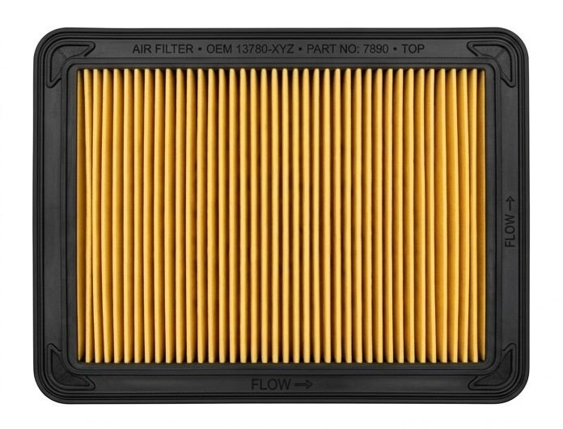
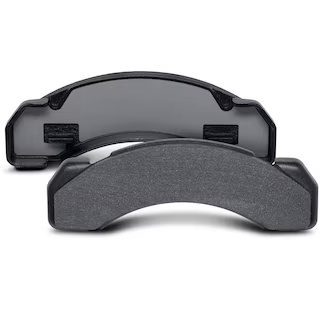
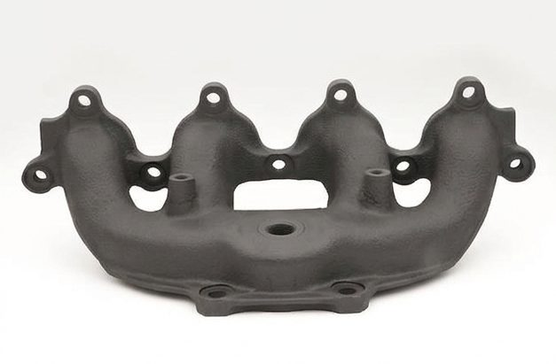
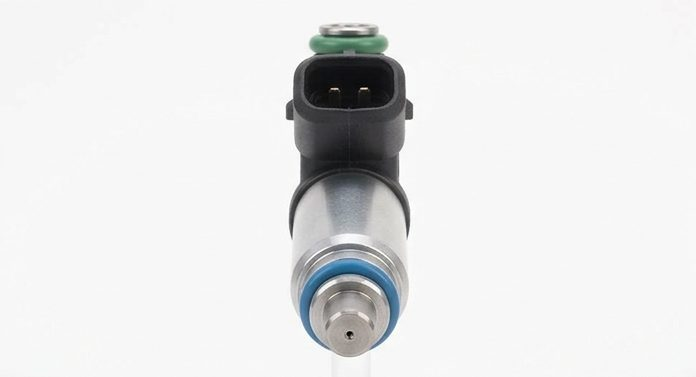
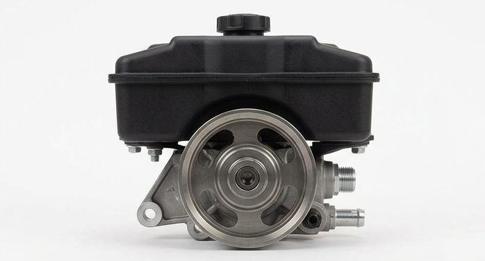
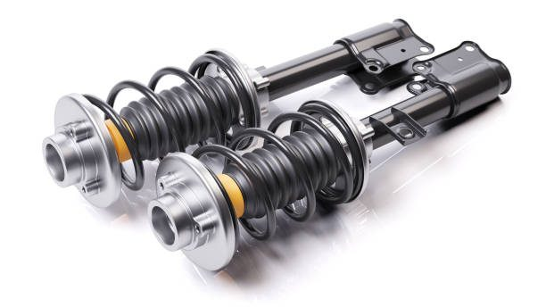
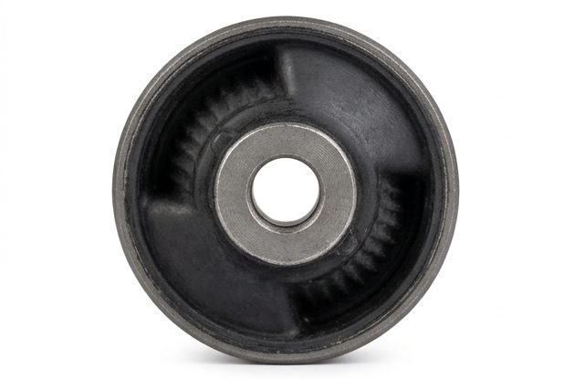
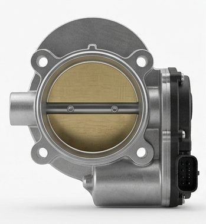
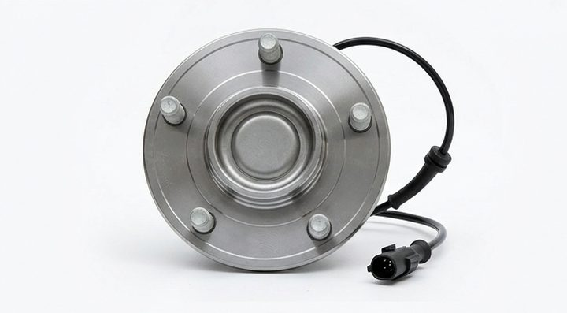
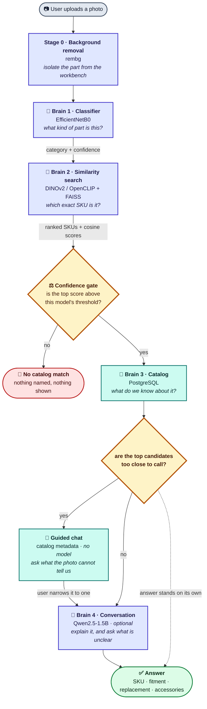

<div align="center">

# 🔧 PartPilot

### Identify any car part from a single photograph — and know when not to guess.

Point a camera at a broken part. Get back the stocked SKU, what vehicles it fits,
what replaces it, and what to buy alongside it.

<br/>

[](#-accuracy)
[](#-accuracy)
[](#-accuracy)
[](#-refusing-to-guess)

[](https://www.python.org/)
[](https://fastapi.tiangolo.com/)
[](https://pytorch.org/)
[](https://www.tensorflow.org/)
[](https://faiss.ai/)
[](https://github.com/ggerganov/llama.cpp)
[](https://www.postgresql.org/)
[](https://react.dev/)

<br/>

**[Quickstart](#-quickstart-2-minutes)** ·
**[How it works](#-how-a-photo-becomes-an-answer)** ·
**[The four brains](#-brain-1--what-kind-of-part-is-this)** ·
**[Guided chat](#-guided-chat--the-machine-asks-the-user-picks)** ·
**[Accuracy](#-accuracy)** ·
**[Business impact](#-business-impact)** ·
**[Demo script](#-the-five-minute-demo)** ·
**[Roadmap](#-future-roadmap)**

</div>

---

## 🎯 The problem

Someone holding a broken car part usually cannot name it. The part number is worn
off, the box is long gone, and searching *"black round metal car thing"* finds
nothing. Today they photograph it, send it to a parts counter, and wait for a
human who has seen that part before.

**PartPilot answers that in one upload.**

The harder half of the goal is knowing when ***not*** to answer. A parts catalog
that confidently names the wrong brake pad is worse than one that admits it does
not stock the part — the customer fits it, it fails, and they do not come back.

> **So refusing is a designed feature here — measured, calibrated and tuned — not an error path.**

<br/>

<div align="center">

### The catalog it searches — 56 products, 10 categories

<table>
<tr>
<td align="center"><br/><sub><b>Air Filter</b><br/>5 SKUs</sub></td>
<td align="center"><br/><sub><b>Brake Pads</b><br/>6 SKUs</sub></td>
<td align="center"><br/><sub><b>Exhaust Manifold</b><br/>8 SKUs</sub></td>
<td align="center"><br/><sub><b>Fuel Injector</b><br/>5 SKUs</sub></td>
<td align="center"><br/><sub><b>Oil Filter</b><br/>3 SKUs</sub></td>
</tr>
<tr>
<td align="center"><br/><sub><b>Power Steering Pump</b><br/>4 SKUs</sub></td>
<td align="center"><br/><sub><b>Shock Absorber</b><br/>8 SKUs</sub></td>
<td align="center"><br/><sub><b>Suspension Bushing</b><br/>8 SKUs</sub></td>
<td align="center"><br/><sub><b>Throttle Body</b><br/>5 SKUs</sub></td>
<td align="center"><br/><sub><b>Wheel Hub Assembly</b><br/>4 SKUs</sub></td>
</tr>
</table>

</div>

---

## ⚡ Quickstart (2 minutes)

**The whole user journey runs with no backend, no database and no model
downloads.** The frontend ships with canned data, so this works on any machine
with Node installed:

```bash
git clone https://github.com/zubariyasulekaz/Parts-Detection-Hackathon.git
cd Parts-Detection-Hackathon/frontend
npm install
cp .env.example .env        # VITE_API_MODE=mock is already the default
npm run dev
```

➡️ Open **<http://localhost:5173>** and follow the [demo script](#-the-five-minute-demo).

<br/>

<details>
<summary><b>🔌 Running the real pipeline (models + database) — click to expand</b></summary>

<br/>

### Before you start — two things are *not* in the repo

| What | Why | Do you need it? |
|---|---|---|
| `DATABASE_URL` | contains a password, so it stays out of git | **Yes** — ask the team before you begin |
| `partpilot_images_v3.zip` | ~50 MB of catalog photos, git-ignored | Only to *rebuild* indexes — not to run |

> ⚠️ **Get the `DATABASE_URL` first.** The install below pulls TensorFlow, PyTorch
> and FAISS — several GB — so line the connection string up first and the rest of
> the setup runs straight through.

### 1. Environment

Python **3.10–3.12** (TensorFlow 2.18 does not support 3.13).

```bash
cd partpilot
python -m venv .venv
```

```powershell
.venv\Scripts\Activate.ps1     # Windows
```
```bash
source .venv/bin/activate      # macOS / Linux
```

### 2. Install

```bash
pip install -r requirements.txt
```

> ℹ️ `llama-cpp-python` (the Brain 4 runtime) is deliberately **not** in
> `requirements.txt` — its source build fails outright on Windows without
> Long Path support enabled, which would break the base install for
> everyone. Brain 4 is optional either way; the answer never depends on it.
> Only install it if you want the LLM-generated explanation text, from the
> project's own prebuilt wheels (no compiler needed):
>
> ```bash
> pip install llama-cpp-python --prefer-binary \
>   --extra-index-url https://abetlen.github.io/llama-cpp-python/whl/cpu
> ```
>
> Or set `LLM_BACKEND=transformers` in `.env` to use the slower
> no-extra-dependency path instead.

### 3. Configure

```bash
cp .env.example .env           # copy .env.example on Windows
```

Set `DATABASE_URL` to the string the team gave you. **Leave everything else
alone** — every threshold is already tuned. `.env` is git-ignored; never paste
the connection string into an issue or a PR.

### 4. Run

```bash
python -m backend.main
```

➡️ Open **<http://localhost:8000/docs>**, find `POST /api/v1/predict`, click
**Try it out**, upload a part photo, **Execute**.

### 5. Point the frontend at it

```bash
cd ../frontend && cp .env.example .env
```

In `frontend/.env` set:

```bash
VITE_API_MODE=live     # call the real backend instead of the canned data
VITE_CHAT_API=true     # run the guided chat through the server session API
```

then `npm run dev`. With `VITE_CHAT_API=false` the questions still work — they
just run in the browser against the same logic, which is what mock mode uses.

### Already done for you

Everything heavy ships with the repo, so install → configure → run is the whole
path:

| | Ready to use |
|:--|:--|
| ✅ **Brain 1** | the trained classifier is committed in `backend/models/classifier/` |
| ✅ **Brain 2** | the FAISS indexes are committed in `backend/models/faiss/` |
| ✅ **Brain 3** | all 56 products are already live in the shared database |

That means you can go straight to step 4 — training, index building and database
migrations are all behind you.

**Startup takes ~50 s** while all four brains warm up — the log shows each one as
it lands. That is deliberate: `WARM_MODELS_ON_STARTUP` (and
`WARM_BRAIN4_ON_STARTUP`) pay the model load at boot rather than making whoever
uploads first wait it out. The models themselves download once on first run.

📖 Full setup, troubleshooting and index rebuilding: **[`partpilot/docs/RUNNING.md`](partpilot/docs/RUNNING.md)**

</details>

---

## 🧠 How a photo becomes an answer

Four stages, called **Brains 1 to 4**. Each has exactly one job and hands its
output to the next.



### The whole system on one line each

| Stage | The question it answers | Technology | What it hands on |
|:--|:--|:--|:--|
| **Stage 0** | *Where is the part in this photo?* | `rembg` segmentation | the part alone, on white |
| **🧠 Brain 1** | *What kind of part is this?* | EfficientNetB0 | 1 of 10 categories + confidence |
| **🧠 Brain 2** | *Which exact SKU is it?* | DINOv2 / OpenCLIP + FAISS | ranked SKUs with cosine scores |
| **⚖️ Gate** | *Are we sure enough to answer at all?* | per-model calibrated thresholds | **answer, or refuse** |
| **🧠 Brain 3** | *What is actually true about it?* | PostgreSQL | product record + recommendations |
| **💬 Guided chat** | *Which of these look-alikes is it?* | catalog metadata — **no model** | one narrowing question at a time |
| **🧠 Brain 4** | *How do we explain it to the user?* | Qwen2.5-1.5B via llama.cpp *(optional)* | an explanation + clarifying questions |

> **Everything before the gate is a model. Everything after it is data.**
>
> That split is deliberate: the models decide *which* part, the database decides
> *what is true about* that part, and **no language model is ever asked to invent
> a fact about stock.**

**Where the code lives:** [`partpilot/backend/pipeline/orchestrator.py`](partpilot/backend/pipeline/orchestrator.py)
wires the four stages together and contains no AI logic itself — every stage is
injected as an interface, so any one can be swapped or mocked without touching
the others.

---

## 🖼️ Stage 0 — Background removal

<table>
<tr><td><b>In</b></td><td>the uploaded photo, as decoded pixels</td></tr>
<tr><td><b>Out</b></td><td>the same part on a plain white background</td></tr>
<tr><td><b>Model</b></td><td><code>rembg</code> (ONNX segmentation)</td></tr>
</table>

Catalog photos are shot on white. User photos are shot on a workbench, a garage
floor, a car seat. Left alone, the models partly match on **background** rather
than part — *a filter on a wooden bench looks more like another photo of wood
than like the same filter on white.*

`rembg` segments the part and fills the rest with white, so Brain 1 and Brain 2
both see the part alone. It runs **once**, upstream of both, so the two brains
can never disagree about what they are looking at.

The original photo is kept and travels alongside the cleaned one — if an index
was built *without* background removal, the search uses the original instead, so
**the query always matches how the index was built.**

---

## 🧠 Brain 1 — What kind of part is this?

<table>
<tr><td><b>In</b></td><td>background-removed image</td></tr>
<tr><td><b>Out</b></td><td>category name + confidence + <b>a full ranking of all 10 categories</b></td></tr>
<tr><td><b>Model</b></td><td>EfficientNetB0, ImageNet weights, frozen base + fresh 10-way softmax head</td></tr>
<tr><td><b>Code</b></td><td><a href="partpilot/backend/pipeline/brain1_classifier/"><code>backend/pipeline/brain1_classifier/</code></a></td></tr>
</table>

### Why it exists

Brain 2 searches inside **one category's index**, not the whole catalog. Brain 1
picks that index. Narrowing to ~5 products before comparing beats searching all
56, because **most wrong answers are parts from a completely different category
that happen to share a silhouette.**

### How it works

EfficientNetB0 is small enough to train on a free Colab GPU *and* to run on a CPU
in production.

**Preprocessing** ([`preprocess.py`](partpilot/backend/pipeline/brain1_classifier/preprocess.py)) —
resize to 224×224. That is all.

> ⚠️ EfficientNet's own normalization is **baked into the saved model graph** by
> the training notebook. Re-applying it here would double-normalize and quietly
> wreck accuracy.

There is an optional pad-to-square step that centres the part on a white canvas
before resizing, so a long part like a shock absorber is not squashed. It is
**off** (`CLASSIFIER_PAD_TO_SQUARE=False`) because the deployed checkpoint was
trained on squashed images — *preprocessing must match training*, so this is
configuration rather than a default.

**Output** ([`predict.py`](partpilot/backend/pipeline/brain1_classifier/predict.py)) —
softmax over 10 classes, sorted descending. Not just the winner: the **full
ranking**, which is what makes the next part possible.

### 🔑 Key decision — handling an unsure classifier

A hard gate at Brain 1 is unrecoverable: **pick the wrong category and Brain 2
will never look in the right index, however good it is.**

So when confidence falls below `CLASSIFIER_CONFIDENCE_THRESHOLD` (**0.5**), the
orchestrator searches the **runner-up category as well**. Both searches run, and
the winner is whichever category's top match clears *its own* threshold by the
largest margin.

> Comparing **margins** rather than raw scores matters: the two categories may use
> different embedding models, and a DINOv2 cosine and an OpenCLIP cosine are not
> on the same scale. Distance above each model's own bar is comparable; the raw
> numbers are not.

Being unsure also raises the refusal bar later — see [Refusing to guess](#-refusing-to-guess).

---

## 🧠 Brain 2 — Which exact SKU is it?

<table>
<tr><td><b>In</b></td><td>background-removed image + the category from Brain 1</td></tr>
<tr><td><b>Out</b></td><td>ranked SKUs with cosine similarity scores, plus which model produced them</td></tr>
<tr><td><b>Model</b></td><td>DINOv2 / OpenCLIP / SigLIP → FAISS <code>IndexFlatIP</code>, one index per category</td></tr>
<tr><td><b>Code</b></td><td><a href="partpilot/backend/pipeline/brain2_similarity/"><code>backend/pipeline/brain2_similarity/</code></a></td></tr>
</table>

**This is the core of the project and where most of the measurement went.**

The idea: turn every catalog photo into a vector such that photos of the *same
part* land close together. Do the same to the uploaded photo, then find the
nearest catalog vectors. No text, no part numbers — **pure visual similarity.**

### Step 1 · Embedding the image

[`embedding_backends.py`](partpilot/backend/pipeline/brain2_similarity/embedding_backends.py)
supports three open-weight model families behind one interface:

| Backend | Model | Dim | Trained how |
|:--|:--|:--:|:--|
| **`dinov2`** *(default)* | `facebook/dinov2-base` | 768 | Self-supervised, images only |
| `openclip` | `ViT-B-32` / openai | 512 | Image–text alignment |
| `siglip` | `google/siglip-base-patch16-224` | 768 | Image–text, better loss |

DINOv2 is the default because, being self-supervised on images alone, it
optimises for ***"is this the same object"*** rather than *"what is this called"*
— which is exactly the catalog-matching question.

Backends can also be combined with `+` (e.g. `dinov2+siglip`): each vector is
normalized, concatenated and re-normalized, which makes the combined cosine the
**average** of the individual cosines — the models vote.

### Step 2 · 🔑 Per-category model routing — *a measured finding*

**No single model wins everywhere.** Benchmarking every category separately showed
DINOv2 far ahead on parts that differ *structurally*, and behind on parts where
every product shares the same texture and the difference is fine detail:

| Category | DINOv2 | OpenCLIP | → Routed to |
|:--|:--:|:--:|:--|
| Air Filter | 66.7% | **95.2%** | 🟠 OpenCLIP |
| Wheel Hub Assembly | 16.7% | **33.3%** | 🟠 OpenCLIP |
| Shock Absorber | 95.8% | **100%** | 🟠 OpenCLIP |
| *everything else* | **best** | — | 🔵 DINOv2 |

So `CATEGORY_BACKENDS` overrides the default for exactly those three. Since every
category already owns a separate index, each can be built by whichever model
scored best for it — **no extra machinery required.**

> ### 🔬 The experiment that shaped the design
>
> Testing the obvious alternative first mattered here. The **DINOv2 + OpenCLIP
> ensemble scored 72.8%, while DINOv2 alone reached 73.2%** — measurably behind it.
>
> Averaging two models is a compromise, not a maximum: it pulls the strong model
> toward the weak one. **That measurement is what pointed to routing instead of
> blending** — and routing went on to deliver the single biggest gain in the table.

### Step 3 · Test-time augmentation

[`embedding_generator.py`](partpilot/backend/pipeline/brain2_similarity/embedding_generator.py)
encodes the image **and its mirror**, averages the two vectors, and re-normalizes
(`EMBEDDING_TTA=True`). A part photographed from the "wrong" side still lands
near its catalog shots. Because index-building and querying both go through this
one class, they *cannot* disagree about the setting.

### Step 4 · The index

[`faiss_index.py`](partpilot/backend/pipeline/brain2_similarity/faiss_index.py) —
one `faiss.IndexFlatIP` per category. Since both stored and query vectors are
L2-normalized, **inner product equals cosine similarity**, so scores land in
`[-1, 1]`.

Each index ships with two sidecar files:

| File | Holds |
|:--|:--|
| `<category>.faiss` | the vectors |
| `<category>.ids.json` | row number → SKU (`IndexFlatIP` stores only vectors) |
| `<category>.meta.json` | which model built it, and whether backgrounds were removed |

> That metadata is not bookkeeping — **the search reads it to decide how to embed
> the query.** A query embedded by a different model than the index is not
> comparable to it, and *the failure is silent*: you get scores, they are just
> meaningless. The index says how it was built, and the query follows.

### Step 5 · 🔑 Scoring: centroid, not best photo

Each product has **2–7 photos**, and each photo is stored as its own row. So how
should a product be scored — by its *best-matching* photo, or by its *average*?

Measured both ways over the real index ([`scripts/analyze_index_vectors.py`](partpilot/scripts/analyze_index_vectors.py)):

| Scoring strategy | Correct SKU ranked first |
|:--|:--:|
| ✅ **Centroid** (mean of the product's vectors) | **79%** |
| Max over images (best single photo) | 72% |

Max-over-images loses because with only a handful of photos per product, **one
lucky angle promotes the wrong SKU.** The centroid averages that noise out. So at
load time the index computes one L2-normalized centroid per SKU and scores
against those.

Per-image vectors are still *stored* rather than a prebuilt centroid, because
that keeps every photo inspectable, lets the evaluation exclude a held-out image
exactly, and leaves room to re-aggregate without re-embedding anything.

---

## ⚖️ Refusing to guess

<table>
<tr><td><b>In</b></td><td>the top similarity score, the backend that produced it, whether Brain 1 was sure</td></tr>
<tr><td><b>Out</b></td><td>a verdict — <b>answer</b>, or <b>refuse</b></td></tr>
</table>

**Most of the interesting design is here.**

### Per-backend thresholds

The two models compress cosine space very differently. An out-of-catalog image
tops out around **0.83 on DINOv2** but **0.92 on OpenCLIP** — one global threshold
cannot serve both. So thresholds are keyed per backend, calibrated against the
measured score distributions of correct matches and impostors:

```text
 dinov2     0.45  →  0.0% correct rejected  /  90.0% impostors caught
            0.48  →  1.3% correct rejected  /  93.1% impostors caught   ✅ chosen

 openclip   0.84  →  0.0% correct rejected  /  43.9% impostors caught
            0.86  →  1.5% correct rejected  /  62.1% impostors caught   ✅ chosen
```

> ### 💰 The trade is explicit and priced
> Roughly **1.5% of correct matches are given up to catch most impostors.**
> Recommending the wrong part is worse than admitting the catalog does not have it.

*(OpenCLIP's distributions genuinely overlap more — a known, accepted cost of
keeping it for the three categories where it ranks far better.)*

### Two weak signals must not add up to a confident answer

If Brain 1 was itself unsure of the category, the threshold **rises** by
`NO_MATCH_UNCERTAIN_MARGIN` (**+0.04**).

> *"Not sure what kind of part this is"* + *"nothing especially close in that
> category"* should **not** combine into a confidently named SKU.

### What a refusal actually does

On a no-match the pipeline **skips Brain 3 entirely** — no product lookup, no
recommendations. The response carries no top SKU and nothing selectable in the
UI. The audit trail records the near-misses as *context*, **not as an answer**.

> **A refusal is a refusal all the way down** — not a product page with a quiet warning.

---

## 🧠 Brain 3 — What do we know about this part?

<table>
<tr><td><b>In</b></td><td>one SKU — <i>only</i> if it cleared the threshold</td></tr>
<tr><td><b>Out</b></td><td>the full product record + related products</td></tr>
<tr><td><b>Stack</b></td><td>PostgreSQL (Supabase) · SQLAlchemy async + asyncpg · Alembic migrations</td></tr>
<tr><td><b>Code</b></td><td><a href="partpilot/backend/pipeline/brain3_catalog/"><code>backend/pipeline/brain3_catalog/</code></a></td></tr>
</table>

### What a product holds

| Field | Meaning |
|:--|:--|
| `sku` | primary key |
| `product_name`, `brand`, `category` | the basics |
| `manufacturer_part_number` | the number stamped on the part, e.g. `DE1439` |
| `compatible_vehicles` | make / model / year rows |
| `replacement_sku` | the part that supersedes this one |
| `alternative_skus` | equivalents from other brands |
| `accessory_skus` | what you should buy with it |
| `attributes` | open key/value bag — `filter_style`, `position`, `primary_colour`… keys vary by category |
| `image_paths` | catalog photos |

`attributes` is deliberately open-ended: **what visually separates two air filters
is not what separates two brake pads**, so the schema does not pretend otherwise.
These fields are what the [guided chat](#-guided-chat--the-machine-asks-the-user-picks)
turns into questions later.

### Recommendations

[`recommendation_service.py`](partpilot/backend/pipeline/brain3_catalog/recommendation_service.py)
is pure catalog logic, **no model**:

- **Alternatives** = `replacement_sku` first, then `alternative_skus`, de-duplicated, with the product itself excluded
- **Accessories** = `accessory_skus`
- A referenced SKU missing from the catalog is skipped with a warning rather than crashing the response

Replacement comes first deliberately — **if a part has been superseded, that is
the one the customer should actually buy.**

---

## 🧠 Brain 4 — Talk the answer through

<table>
<tr><td><b>In</b></td><td>the Brain 1–3 outputs (category, scores, product, recommendations)</td></tr>
<tr><td><b>Out</b></td><td>a short explanation of the match, plus up to <b>3 clarifying questions</b> when something is genuinely ambiguous</td></tr>
<tr><td><b>Model</b></td><td><code>Qwen2.5-1.5B-Instruct</code> — chat-formatted turns, 256 max new tokens, greedy decoding</td></tr>
<tr><td><b>Runtime</b></td><td><b>llama.cpp</b> on a Q4 GGUF by default; Hugging Face <code>transformers</code> as the zero-extra-dependency fallback (<code>LLM_BACKEND</code>)</td></tr>
<tr><td><b>Code</b></td><td><a href="partpilot/backend/pipeline/brain4_reasoning/"><code>backend/pipeline/brain4_reasoning/</code></a></td></tr>
<tr><td><b>Scope</b></td><td>one focused assistant turn per identification — the multi-turn conversation is <a href="#-guided-chat--the-machine-asks-the-user-picks">Brain 3's job, not the LLM's</a></td></tr>
</table>

Brain 4 is the **assistant voice** on top of the pipeline. It is given the whole
decision — category, the ranked SKUs and their scores, the matched product and
its recommendations — as a chat turn against a fixed PartPilot persona
([`prompt_builder.py`](partpilot/backend/pipeline/brain4_reasoning/prompt_builder.py)),
and does two things:

| | |
|:--|:--|
| 💬 **Explains the match** | two to four sentences, under 150 words |
| ❓ **Asks what it needs to know** | up to three short, specific questions — but **only** when the result is genuinely ambiguous: several compatible vehicles, low confidence, or multiple close-scoring alternatives. When the match is clean, it says so plainly and asks nothing. |

Greedy decoding means the same input always produces the same answer — which
matters for a demo.

### 🔑 Key decision — the runtime was the bottleneck, not the model

The first working version ran full-precision weights through `transformers` and
took **23.5 seconds** per explanation on a CPU box. Unusable in front of a user.

The instinct is to reach for a smaller model. That was measured, and it was the
wrong lever — a 0.5B model was still slow *and* started inventing facts, claiming
parts were "worn out" and describing a Bosch SKU as "another brand name for the
same product" when it is a different manufacturer's part.

Swapping the **runtime** rather than the model fixed both:

| | `transformers`, 0.5B | **llama.cpp, 1.5B Q4** |
|---|---:|---:|
| Explanation time (warm) | 23.5s | **5.1s** |
| File on disk | ~1 GB | **~1 GB** |
| Invented facts in the test prompt | 2 | **0** |

A 4-bit quantised 1.5B model is **smaller on disk than the 0.5B in full
precision** and three times the parameters — better prose *and* faster, from the
same catalog facts. Brain 4 is also warmed at startup
(`WARM_BRAIN4_ON_STARTUP`), so the first upload after a restart does not pay the
model load.

### 🔑 Key decision — the answer is complete before Brain 4 speaks

By the time Brain 4 is called, Brains 1–3 have **already produced the full
result**: the SKU, the fitment, the replacement and the accessories. Brain 4 adds
a voice to that answer; it is never the thing that produces it.

So the explanation is treated as purely **additive**. The orchestrator isolates
the whole reasoning step, which means the identified part and its
recommendations always reach the user intact and on time — the dotted line
straight from Brain 3 to the answer in the diagram above.

The model itself loads **once and is cached process-wide**, and the outcome of
that first load is remembered, so a heavy one-time initialisation is never
repeated per request. Every prediction after the first is served straight from
the warm instance.

### 🔑 Key decision — the LLM is kept away from the facts

Brain 4 explains a decision that has **already been made** from catalog data. It
is never asked which part it is, and never asked to produce a part number.

> **A language model asked to name a SKU will invent a plausible one.** In a parts
> catalog that is the exact failure the no-match threshold exists to prevent — so
> the architecture does not give it the chance.

---

## 💬 Guided chat — the machine asks, the user picks

Some parts cannot be told apart by photograph. Two brake pad sets for different
vehicles are the same object photographed twice; four wheel hubs differ only in
how many studs they carry.

So when the visual search **cannot separate its top candidates**, PartPilot stops
guessing and starts a conversation:

```
🤖  Hi! Your photo is visually close to 3 parts in our catalog.
🤖  What colour is it, mainly?
                                                    Not sure  👤
🤖  Which vehicle is this part for?
                                                      Toyota  👤
🤖  Which model?
                                                      Altima  👤
🤖  ✅ That leaves one match: SHK-1006 — OEM Front Strut Assembly
```

### The user never types — and that is the design

Every answer is a button, and **every button comes from a catalog row**. There is
no free-text box and no language model in this loop, which is what makes three
guarantees possible:

- ✅ every option provably corresponds to real SKUs — nothing can be invented
- ✅ every answer provably narrows the set — each option carries the SKUs it keeps
- ✅ it works with the LLM switched off entirely

### How a question gets chosen

[`backend/pipeline/chat/engine.py`](partpilot/backend/pipeline/chat/engine.py)
looks at the rows still in play and asks: *which column separates them?*

| Facet | Example | Asked… |
|:--|:--|:--|
| Visual attributes | *"How many wheel studs?"*, *"Spin-on or cartridge?"* | **first** — answerable by looking at the part in hand |
| Vehicle make / model / year | *"Which vehicle is this part for?"* | next — the user knows their own car |
| Part number | *"Is one of these numbers on the part?"* | decisive, but means hunting for stamped text |
| Brand | *"Do you know the part brand?"* | **last** |

> Questions are ranked by **how easily a person can answer**, not by elimination
> power. Brand usually splits the candidates perfectly — but someone
> photographing a part to find out what it is is exactly the person who does not
> know its brand.

Two rules keep it honest: a question is skipped if **no answer would rule
anything out**, and vehicle questions are never asked when any candidate has no
fitment on record — missing data must not read as *"does not fit"*.

### Server-side sessions

[`backend/api/routers/chat.py`](partpilot/backend/api/routers/chat.py) —
the conversation lives on the server, not in the browser:

| Endpoint | |
|:--|:--|
| `POST /chat/start` | opens a session from the prediction's candidates |
| `POST /chat/{id}/answer` | one turn — pick an option, or *"Not sure"* |
| `POST /chat/{id}/undo` | rewind the transcript to any earlier turn |
| `GET /chat/{id}` | current state, e.g. after a page reload |

Only SKUs and similarity scores travel up; **every fact the chat asks about is
fetched server-side from the catalog**, so the conversation cannot be fed
invented product data. A skip is recorded as a turn like any other — it happened,
it shapes what gets asked next, and it stays in the transcript.

### When it appears

Only when the photo genuinely could not decide — rank 1 and rank 2 within
`CONFIRMATION_SIMILARITY_GAP` of each other. A clear winner goes straight to the
answer.

> Deliberately not gated on the raw score: a weak-but-clear match needs no
> questions, while a **95% match with a 94% runner-up** is exactly when the
> catalog must be asked. Measured across the sample photos, brake pads (gap 0.26)
> skip the chat while wheel hubs (gap 0.04, top score 0.97) trigger it.

---

## 📊 The audit trail

Every finished run is recorded: predicted category, confidence, search time, the
ranked candidates with scores, which embedding backend was used, and a thumbnail
of the upload.

`POST /api/v1/predict/{audit_id}/confirm` then records which SKU the user actually
settled on. A confirmation matching the pipeline's top SKU **validates** the run;
one that differs labels it a **correction**.

> **That is training data the catalog earns just by being used.**

Recording is a by-product of answering, never a precondition for it — the user's
answer is never held up waiting on the audit write.

---

## 📈 Accuracy

Measured **leave-one-out** over the stored index vectors: each image is excluded
from its own product's centroid before that product is scored, so **nothing is
ever matched against itself** and the numbers reflect an unseen photo arriving.

<div align="center">

| Correct SKU ranked first | Correct SKU in top three | MRR |
|:--:|:--:|:--:|
| **85.0%** | **96.7%** | **0.911** |

*240 queries · 56 products · 10 categories*

</div>

```bash
cd partpilot && python scripts/analyze_index_vectors.py
```

Reads the built indexes rather than re-embedding, so it reproduces the table
below in seconds.

| Category | Backend | Top-1 | Top-3 |
|:--|:--|--:|--:|
| Power Steering Pump | 🔵 DINOv2 | 100.0% | 100.0% |
| Shock Absorber | 🟠 OpenCLIP | 95.8% | 95.8% |
| Fuel Injector | 🔵 DINOv2 | 93.1% | 100.0% |
| Air Filter | 🟠 OpenCLIP | 90.9% | 100.0% |
| Oil Filter | 🔵 DINOv2 | 85.0% | 100.0% |
| Suspension Bushing | 🔵 DINOv2 | 83.3% | 95.8% |
| Throttle Body | 🔵 DINOv2 | 82.8% | 93.1% |
| Brake Pads | 🔵 DINOv2 | 77.4% | 96.8% |
| Wheel Hub Assembly | 🟠 OpenCLIP | 76.2% | 100.0% |
| Exhaust Manifold | 🔵 DINOv2 | 70.8% | 87.5% |

> ### The gap between those two columns is the whole argument for a ranked answer
>
> Where a category scores poorly at rank 1 but near-perfectly by rank 3, the
> correct SKU ***was*** found and merely mis-ordered — several exhaust manifolds
> are the same stainless assembly photographed from a different side.
>
> **No embedding separates what a photograph does not distinguish.** That is what
> disambiguation is for.

### How it got here

| # | Approach | Top-1 | |
|:--:|:--|--:|:--|
| 1 | OpenCLIP baseline | 69.6% | |
| 2 | DINOv2 | 73.2% | |
| 3 | DINOv2 + OpenCLIP ensemble | 72.8% | 🔬 *the measurement that pointed to routing* |
| 4 | Per-category routing | 77.5% | |
| 5 | **+ centroid scoring, image cleaning** | **85.0%** | 🏆 |

---

## 💼 Business impact

Identifying an unlabelled part is a **human lookup** today: photograph it, send it
to a parts counter, wait for someone who has seen that part before. That spends
the counter's time, delays the customer, and does not scale past whoever is on
shift.

| | 🧑‍🔧 Parts counter today | 🤖 PartPilot |
|:--|:--|:--|
| **Who identifies it** | someone experienced | anyone with a phone |
| **Time to an answer** | minutes to hours | seconds |
| **Available** | opening hours | always |
| **Wrong-part risk** | a judgement call | **priced**: ~1.5% of correct matches given up to catch most impostors |

Three things make this worth deploying rather than demoing:

| | |
|:--|:--|
| 🛡️ **It refuses** | A confidently wrong brake pad costs a return, a refit, and the customer. The no-match threshold is calibrated against measured score distributions, so the false-answer rate is **a number someone chose** — not an accident. |
| 🛒 **It sells the rest of the basket** | Every identification also returns the superseding part and the accessories, straight from the catalog. That is attach-rate the counter would otherwise have to remember. |
| 📈 **It improves by being used** | Each confirmation records which SKU the customer actually settled on — labelled training data the catalog earns at **zero labelling cost**. |

> The catalog here is 56 products, so the accuracy figures are **indicative**. The
> architecture does not change at tens of thousands of SKUs — the indexes grow,
> the pipeline does not.

---

## 🎬 The five-minute demo

No backend, no database, no model downloads — the frontend ships with canned data:

```bash
cd frontend && npm install && npm run dev     # VITE_API_MODE=mock by default
```

Four things to show, **in this order**, because each one sets up the next:

| # | Show this | The point |
|:--:|:--|:--|
| **1** | Upload `brake-pads.jpg` | one clear winner (26 points clear of rank 2) → straight to the answer. **No questions asked** — the photo decided. |
| **2** | Upload `wheel-hub-assembly.jpg` | four hubs differing only in stud count, top two **4 points apart** → the [guided chat](#-guided-chat--the-machine-asks-the-user-picks) opens and narrows it to one |
| **3** | Upload something the catalog does not stock | **🚫 no match** — nothing named, nothing selectable; *not* a product page with a warning |
| **4** | Open `/architecture` | the four brains, and where the refusal gate sits |

> **Steps 1 and 2 are a pair — show them back to back.** Same app, same upload
> flow; the chat appears in one and not the other. That contrast *is* the point:
> the questions are not a fixed step in a wizard, they are what happens when the
> models report they could not separate the candidates.

> **Step 3 is the one worth dwelling on.** The first two show a parts catalog
> working. Step 3 shows it *declining to be wrong*, which is the harder half of
> the problem.

**If a judge asks whether the chat is AI-generated:** it is not, and that is
provable on the spot — the questions and every option come from catalog rows, so
the whole conversation still works with the language model switched off
(`LLM_BACKEND` unset, or `VITE_PREDICTION_EXPLAIN=false`). Nothing in it can be
invented.

Sample photos for steps 1–2 live in [`frontend/public/samples/`](frontend/public/samples/).
For the live pipeline against the real models and database, follow the
[full setup](#-quickstart-2-minutes) first.

---

## 🗺️ Future roadmap

Ordered by what the measurements say is actually limiting the system — not by
what is interesting to build.

| | Next step | Why it is next |
|:--:|:--|:--|
| **1** | **Fine-tune the embedding on the catalog itself** | Exhaust manifolds sit at 70.8% top-1 but 87.5% top-3 — the right SKU is *found and mis-ordered*. A general-purpose encoder cannot separate what it was never trained to care about; metric learning on the catalog can. |
| **2** | **Ask for a second photo instead of guessing** | Where one angle genuinely cannot distinguish two SKUs, prompting for another view is cheaper and more honest than a re-ranker. The disambiguation flow already exists to hang it on. |
| **3** | **Feed confirmations back into ranking** | The audit trail already captures which SKU the user settled on — the highest-value signal in the whole system. Wiring that straight into ranking turns every confirmation the app collects into a measurable accuracy gain. |
| **4** | **Approximate search at catalog scale** | `IndexFlatIP` is exact and fast at 56 products. Past roughly 10⁵ vectors per category it stops being free and becomes IVF or HNSW — a swap behind the existing index interface. |
| **5** | **Re-calibrate thresholds on real traffic** | Thresholds were tuned against catalog photos. Phone photos in a garage will shift both distributions, making calibration a recurring **operations** task rather than a one-off. |
| **6** | **Persist chat sessions outside the process** | The [guided chat](#-guided-chat--the-machine-asks-the-user-picks) keeps its sessions in process memory, which is right for one worker and this catalog. Moving them behind Redis lets the conversation survive a restart and scale across workers — a swap behind the existing session store. |

---

## 📁 Repository layout

```
partpilot/
  backend/
    api/            FastAPI routers (predict, chat, catalog, history, admin, health)
    pipeline/
      brain1_classifier/    EfficientNet category classifier
      brain2_similarity/    embeddings, FAISS, per-category routing
      brain3_catalog/       products, recommendations (PostgreSQL)
      brain4_reasoning/     Qwen explanation (llama.cpp or transformers, optional)
      chat/                 guided-chat question engine + sessions (no model)
      audit/                prediction trail + confirmations
      orchestrator.py       wires the four stages together
    config/settings.py      every threshold and model choice, in one file
    models/faiss/           the built indexes, one set per category
  scripts/          index building, evaluation, threshold calibration
  datasets/         catalog.csv (images are git-ignored)
  docs/             RUNNING.md (setup), DEMO_GUIDE.md (Colab demo)
frontend/           Vite + React 19 + TypeScript + Tailwind v4
```

Two design rules hold throughout:

> **🔌 Interfaces, not implementations.** The orchestrator depends only on
> `*Interface` ABCs, so any brain can be swapped or mocked without touching the
> others.
>
> **🎛️ Every tuning decision lives in [`settings.py`](partpilot/backend/config/settings.py)**,
> with the measurement that justified it written next to the number.

---

## 📚 Documentation

| Document | Covers |
|:--|:--|
| **[`partpilot/docs/RUNNING.md`](partpilot/docs/RUNNING.md)** | Full backend setup, configuration, troubleshooting, rebuilding indexes |
| **[`frontend/README.md`](frontend/README.md)** | Frontend architecture, mock vs live mode, the 3D/motion layer |
| **[`partpilot/docs/DEMO_GUIDE.md`](partpilot/docs/DEMO_GUIDE.md)** | End-to-end Google Colab demo, including training Brain 1 from scratch |

<div align="center">
<br/>

**Built for the Parts Detection Hackathon.**

*The models decide which part. The database decides what is true about it.*

</div>
